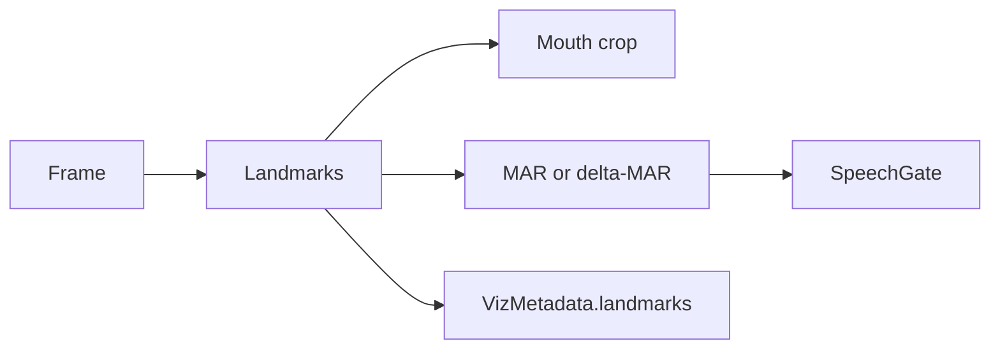

<!-- This is the file for planning and roadmap notes (future work and deferred design) -->
<!-- Rule of thumb for what goes here: "Is this a planned or not-yet-done change?" -->

# Planning notes

Independent roadmap items for this repository (mostly the **`LRM Rust`** crate). Each block below is self-contained. **Code links** are relative to the **repository root** (e.g. `LRM Rust/src/...`).

**Changelog:** keep [`LRM Rust/CHANGELOG.md`](LRM Rust/CHANGELOG.md) next to `Cargo.toml`—that is the usual convention for Rust crates (and tools like `cargo release` / crates.io). Add a **repo-root** changelog only if you need one narrative across Rust + Python + docs.

**Contents**

1. [Error handling and user-facing output](#1-error-handling-and-user-facing-output)
2. [FPS / time normalization for Haar lip motion and speech gating](#2-fps--time-normalization-for-haar-lip-motion-and-speech-gating)
3. [Landmark-based tracking with MAR (deferred)](#3-landmark-based-tracking-with-mar-deferred)
4. [Generic dataset adapter trait (preprocess / corpus standardization)](#4-generic-dataset-adapter-trait-preprocess--corpus-standardization)

---

## 1. Error handling and user-facing output

Roadmap for refactoring error types and **how failures are printed** in the binary and library, grounded in the standard library and common ecosystem crates—not forum-only advice.

### Current state (baseline)

- **Shared error type**: `ESS` is `Box<dyn std::error::Error + Send + Sync>` (via `prelude` in [`LRM Rust/src/lib.rs`](LRM Rust/src/lib.rs)). That pattern is normal for **application-style** propagation where many crates’ errors must flow through one `Result` boundary, including across threads (`Send + Sync`).
- **Message helper**: `io_err` in [`LRM Rust/src/utils.rs`](LRM Rust/src/utils.rs) builds `std::io::Error::new(kind, msg)` and converts into `ESS`, mirroring the std pattern for attaching a message to an `io::ErrorKind`.
- **Binary entry**: `main` returns `Result<(), ESS>` (or equivalent), relying on the standard runtime to report failure.

### Verified fact: why `main -> Result` can look “wrong” on stderr

`std::process::Termination` is the trait that turns `main`’s return value into an exit code. For `Result<T, E>`, the standard library requires **`E: fmt::Debug`** (not `Display`). On `Err`, the runtime prints using **Debug** formatting.

Source (Rust 1.61+): [`impl<T: Termination, E: fmt::Debug> Termination for Result<T, E>`](https://doc.rust-lang.org/src/std/process.rs.html) — on error it uses `format_args_nl!("Error: {err:?}")` (i.e. `{:?}`), not `{}`.

**Implication**: returning `Err` from `main` when `E` is `Box<dyn Error + …>` (or anything whose `Debug` is noisy) produces **Debug-shaped** CLI output. That is expected behavior from `std`, not a bug in your code.

**Minimal, idiomatic UX fix (no new dependencies)**:

- Keep `fn main() { … }` with return type `()` (or `ExitCode` if you prefer).
- Run fallible work in `fn try_main() -> Result<(), ESS>` (name arbitrary).
- On `Err(e)`: print with **`Display`** (e.g. `eprintln!("{e}")` or `eprintln!("error: {e:#}")` for the alternate chain-friendly form where supported), then `std::process::exit(1)` (or return `ExitCode::FAILURE`).

That separates **process termination reporting** from **error type design**.

### Type-alias hardening: `ESS` and `'static`

Today: `Box<dyn std::error::Error + Send + Sync>`.

**Recommendation**: spell the alias as:

`Box<dyn std::error::Error + Send + Sync + 'static>`

Rationale: non-`'static` object-safe errors can carry borrowed data; **`Send` across threads** and **long-lived boxed errors** almost always assume `'static` in practice. If every `ESS` you construct owns its message (strings, `io::Error`, boxed sources), this is a **documentation + future-proofing** tightening, not a behavior change.

**Check before changing**: search for any `ESS` built from types that might borrow non-`'static` data (unusual in this codebase if everything is `'static` strings and std errors).

### Strategic fork: keep `ESS` vs adopt `anyhow` / `thiserror`

#### Applications: `anyhow`

Official crate docs describe `anyhow::Error` / `anyhow::Result<T>` as a single, ergonomic error type for **application** code, with `?` propagation, **context** (`.context("…")`), optional backtraces on recent Rust, and `anyhow!` / `bail!` for ad-hoc errors. See: [docs.rs anyhow](https://docs.rs/anyhow/latest/anyhow/).

**When it fits this repo**: the binary and “glue” layers that orchestrate I/O, CLI, training, and inference—where you want chains like “failed to load checkpoint: … caused by: …” without maintaining a large custom enum.

**Tradeoff**: callers get a rich **opaque** error at the boundary; they match on **downcast** or inspect the display chain, not on a small closed set of variants (unless you add your own typed layer).

#### Libraries: `thiserror` (and typed errors)

`thiserror` generates `std::error::Error` (+ `Display`) impls for **concrete** error enums/structs so **library users can match** and you keep a stable, intentional public surface. See: [docs.rs thiserror](https://docs.rs/thiserror/latest/thiserror/).

**When it fits**: a crate boundary you publish where consumers should distinguish `InvalidConfig` vs `Io` vs `ModelLoad` without string matching.

**Note**: thiserror’s docs explicitly position it alongside anyhow: anyhow for apps, typed errors (often with thiserror) for libraries.

#### Keeping `ESS` + `io_err`

Still valid if you want **zero extra dependencies** and a single thread-safe boxed trait object. Pair it with:

- Explicit **`'static`** on the alias.
- **`try_main` + `Display` printing** for the binary (see above).
- Optional: thin wrappers that attach context as **strings** (less structured than anyhow’s chain, but dependency-free).

### Suggested phases (incremental)

| Phase | Goal | Risk |
|-------|------|------|
| **0** | Fix CLI reporting: `try_main`, `eprintln!("{e}")` (or `{e:#}`), explicit non-zero exit. | Low; localized to `main` (and any other binaries). |
| **1** | Add `+ 'static` to `ESS`; fix any compile fallout. | Low if all sources are already `'static`. |
| **2** (optional) | Add `anyhow` to the **binary**: `try_main() -> anyhow::Result<()>`; convert `ESS` at boundaries with `.map_err(|e| anyhow::Error::from(e))` or gradual `?` migration inward. | Medium: many `Result<_, ESS>` signatures; do **module-by-module** starting at `main` and `cli`. |
| **3** (optional) | Introduce **one** small typed error enum with `thiserror` for a specific subsystem that benefits from `match` (e.g. config resolution only). | Medium: API design; avoid mixing too many error idioms without clear boundaries. |

### Documentation links (bookmark)

- [`std::process::Termination`](https://doc.rust-lang.org/std/process/trait.Termination.html) — trait overview and implementors list.
- [`std::process` source: `Termination for Result`](https://doc.rust-lang.org/src/std/process.rs.html) — confirms `Debug` printing on `Err`.
- [anyhow crate docs](https://docs.rs/anyhow/latest/anyhow/) — application error type, context, backtraces.
- [thiserror crate docs](https://docs.rs/thiserror/latest/thiserror/) — derive `Error` for library-style enums.

### Success criteria

- **Users** see human-readable messages on failure (typically `Display`, optionally multi-line cause chains if you adopt anyhow or manual chaining).
- **Authors** know whether a failure came from **termination** (`Debug` in std) vs **your** reporting (`Display`).
- **Thread-heavy paths** keep `Send + Sync` (and `'static`) on the shared error type.
- **Dependencies** stay justified: add anyhow/thiserror only where the ergonomics or API stability win is clear.

---

## 2. FPS / time normalization for Haar lip motion and speech gating

Cross-reference: `NOTES.md` (tracker pipeline, pending “FPS / delta-time normalization”, “Normalize Haar Has Lip Motion Output By Time”, dataset FPS standardization).

### Problem

Live and file video sources run at different frame rates. Two coupled behaviors make **`speech_active`** (via [`SpeechGate`](LRM Rust/src/inference/speech_gate.rs)) feel inconsistent:

1. **`has_lip_motion` is frame-difference based**  
   In [`HaarTracker::has_lip_motion`](LRM Rust/src/pipeline/tracker/haar.rs), motion is inferred from **consecutive-frame** statistics: MAD of Sobel gradient magnitudes between `prev_magnitude` and the current crop, compared to fixed config thresholds (`energy_threshold`, `mouth_isolation_ratio`, etc.).  
   At **higher FPS**, the time gap \(\Delta t\) between consecutive frames is **smaller** for the same articulation speed, so pixel / gradient fields change **less per frame**. The same physical motion produces **lower per-frame** `inner_mean` (and related ratios), so the detector more often falls **below** threshold → **`has_lip_motion` is false more often**.

2. **`SpeechGate` counts frames, not seconds**  
   [`SpeechGate::update`](LRM Rust/src/inference/speech_gate.rs) requires `on_threshold` consecutive frames with `has_lock && has_lip_motion` before `speech_active` turns on. Higher FPS means each “streak frame” spans **less wall-clock time**, but if `has_lip_motion` is **sparser** at high FPS (point 1), the streak **never reaches** the threshold → **speech activity is harder to turn on** (and can flicker differently when it does).

Lower FPS can exaggerate the opposite failure mode (larger per-frame deltas, noisier ratio), so the fix should aim for **approximately FPS-invariant physics**, not only “help high FPS.”

### Direction (two layers; can ship separately)

**Layer A — Time-aware motion signal (primary, tracker-local)**  
Thread an effective **\(\Delta t\)** (or FPS) into the tracker path on each `process_frame` call:

- Prefer **measured** spacing: `dt = now - last_frame_time` (live camera) or `1 / fps` from container metadata when trustworthy; clamp to sane bounds to avoid division blowups on glitches.
- **Rescale the motion statistic** before comparing to `energy_threshold`. A minimal first pass is **divide `inner_mean` by `dt`** (or multiply threshold by `dt`) so you compare roughly “rate of change per second” instead of “per arbitrary frame interval.”  
  Validate on a matrix: **15 / 24 / 30 / 60 FPS** with the same recorded motion (or synthetic crop sequences) and tune thresholds once in “per second” units.

**Layer B — Optional dataset / pipeline FPS policy (secondary)**  
`NOTES.md` mentions standardizing to a **target FPS (e.g. 25)** with **frame dropping** preferred over interpolation for training data. That stabilizes **training** statistics and keeps ghosting out of labels; it is **orthogonal** to Layer A but reduces how many distinct input regimes the live tracker must handle.

### API / plumbing sketch

- Extend [`LipTrackerBackend::process_frame`](LRM Rust/src/pipeline/tracker/tracker.rs) (or a side channel only used by inference) to accept **`dt: Option<Duration>`** or **`fps: Option<f32>`** per call, or set a **`set_timebase(...)`** on reset when opening a capture / file.  
- Live capture path: wherever frames are pulled (e.g. OpenCV / predictor loop), stamp `Instant::now()` and pass \(\Delta t\).  
- File video: read FPS from `VideoCapture` / demuxer when available; if unknown, fall back to nominal 25 or measured inter-arrival times.

### `SpeechGate` (optional follow-up)

Frame-count thresholds (`on_threshold`, `off_threshold`) are inherently **shorter in wall-clock time** at high FPS. After Layer A, if UX still varies:

- Express hysteresis in **milliseconds** internally (`on_ms`, `off_ms`) and convert to frames with `ceil(ms / dt)` per update, **or**
- Keep frame counts but document that they are tuned for a **nominal FPS** and should be adjusted when changing camera—less ideal.

A separate idea in `NOTES.md` is **different hysteresis for “speech active” vs model inferencing**; treat that as a third work item if you want more responsive UI with smoother decoding.

### Phases

| Phase | Goal |
|-------|------|
| **0** | Instrument and log `dt`, `has_lip_motion`, and `speech_active` transitions at 15/30/60 FPS on the same hardware clip to confirm the hypothesis. |
| **1** | Implement \(\Delta t\) plumbing + one simple normalization rule for `inner_mean` (or equivalent); retune `energy_threshold` in “per second” semantics; regression-test live + file. |
| **2** | Optional: training pipeline target FPS (e.g. 25) via decimation for dataset parity with `NOTES.md`. |
| **3** | Optional: time-based `SpeechGate` or split hysteresis paths as in `NOTES.md`. |

### Success criteria

- For similar **physical** talking motion, **`has_lip_motion`** duty cycle and **`SpeechGate`** time-to-on are within an agreed tolerance across **at least 24–60 FPS** on the same camera or the same offline clip re-timed.
- No large regression on **low** FPS (motion not stuck “always on”).
- Config remains understandable: document whether thresholds are **per second** vs **per frame** after the change.

---

## 3. Landmark-based tracking with MAR (deferred)

**Status:** Hold until Haar-side **edge / temporal energy** work is in a good place (see [§2](#2-fps--time-normalization-for-haar-lip-motion-and-speech-gating) for FPS–time normalization and related Haar behavior). If you revive a standalone write-up, you can link it here (e.g. `edge_based_temporal_energy.plan.md`).

**Scope:** New tracker backend implementing **`has_lip_motion`** via MAR / ΔMAR instead of (or in addition to) Haar gradient-MAD.

### Why MAR / landmarks

**Mouth aspect ratio (MAR)** and similar metrics measure **shape change relative to the face**, not raw bitmap change. That can separate **articulation** from **whole-patch rigid motion** (e.g. head rotation) when landmarks are stable.

**Haar crop limits:** raw-pixel and gradient-MAD on the stabilized Haar crop still share a fundamental issue: the crop is a **moving texture**; strong pose change can dominate the signal. A landmark path is a complementary backend, not a duplicate tweak of the same statistic.

### Codebase hooks (intent unchanged)

- [`VizMetadata::landmarks`](LRM Rust/src/pipeline/tracker/tracker.rs) — overlay already supports drawing landmarks in [`LRM Rust/src/inference/overlay.rs`](LRM Rust/src/inference/overlay.rs).
- [`TrackerConfig`](LRM Rust/src/pipeline/tracker/tracker.rs) — add a variant when implementing (e.g. `MediaPipe(MediaPipeTrackerConfig)` or `Landmarks(...)`), alongside existing `Haar(...)`.

### Implementation outline

1. **Spike:** Choose Rust crate vs FFI vs ONNX face mesh; confirm macOS build and per-frame latency budget for live inference.
2. **New backend module:** Implement [`LipTrackerBackend`](LRM Rust/src/pipeline/tracker/tracker.rs): `process_frame` returns the mouth crop and fills `landmarks`; `has_lock` from detection confidence / visibility; **`has_lip_motion`** from MAR absolute threshold and/or **frame-to-frame ΔMAR** so the existing [`SpeechGate`](LRM Rust/src/inference/speech_gate.rs) hysteresis stays meaningful.
3. **Wire:** [`TrackerConfig`](LRM Rust/src/pipeline/tracker/tracker.rs), [`infer`](LRM Rust/src/inference/predictor.rs), [`main.rs`](LRM Rust/src/main.rs), and training / dataset paths that construct trackers.
4. **CLI / assets:** Tracker selection + model paths as needed; document dependencies in [`LRM Rust/CHANGELOG.md`](LRM Rust/CHANGELOG.md) and [`README.md`](README.md) when shipped.

### Data flow (target architecture)

### Success criteria (when un-deferred)

- Comparable or better **speech gating** stability vs Haar on head motion–heavy clips, without abandoning `SpeechGate`’s frame-based API (unless you intentionally move to time-based thresholds per §2).
- Landmarks exposed for **debug overlay** consistently with Haar metadata.
- Clear **fallback** path: Haar remains default until the new backend is opt-in and documented.

---

## 4. Generic dataset adapter trait (preprocess / corpus standardization)

Roadmap for a **typed corpus-preprocess contract** so multiple on-disk dataset layouts can converge to the same **sharded video–transcript bundle** shape and **standard file formats** (`.mp4` + `.txt`), without scattering GRID-only calls through `main` / the learner. Grounded in today’s [`LRM Rust/src/pipeline/adapters/grid/grid_adapter.rs`](LRM Rust/src/pipeline/adapters/grid/grid_adapter.rs) and [`grid` module re-exports](LRM Rust/src/pipeline/adapters/grid/mod.rs).

**Cross-ref:** A trait pays off most clearly when a **second** `DatasetSource` is real, not just stubbed; until then, module docs + an enum `match` are acceptable. This plan is the path to make a second corpus plug in without duplicating conventions.

### Current state (baseline)

- **GRID-specific API**: `align_grid_directories`, `bundle_grid_utterances`, `normalize_to_standard_formats` (orchestrates per-utterance conversion), `convert_to_standard_mp4`, `convert_to_standard_txt`, `clean_corpus` — all in `grid_adapter` / re-exported from `adapters::grid`.
- **Dispatch**: `DatasetSource::Grid` in [`LRM Rust/src/main.rs`](LRM Rust/src/main.rs) (preprocess path) and training/inference still assume GRID concretely where loaders build `GridDataset`.
- **Documented intent** (in `grid_adapter` module docs): other corpora should provide **their own** adapter that yields the same **bundle shape**, not GRID-only discovery/mapping inside shared code.

### Problem

- The **on-disk output contract** (per-speaker/utterance bundles, standard extensions, optional legacy cleanup) is only expressed as **comments + GRID function names**, not as something implementors must satisfy.
- Adding **LRW** (or another source) will either copy-paste a `match` of phase calls or grow **divergent** “standardization” stories unless one abstraction names the phases and the **end state** clearly.

### Code layout (target)

- The **trait and shared spec** (doc comments, optional path constants) live under [`LRM Rust/src/pipeline/adapters/`](LRM Rust/src/pipeline/adapters/) — a sibling module to `grid/` (e.g. `corpus` / `preprocess` / `contract`), not a new top-level `src/` area — and are re-exported from [`LRM Rust/src/pipeline/adapters/mod.rs`](LRM Rust/src/pipeline/adapters/mod.rs) as appropriate.
- **Per-corpus** implementations stay in `adapters/<corpus>/` (today `adapters/grid/`), each implementing the trait by delegating to existing normalize/bundle/clean logic or new corpus-specific fns.

### Direction (two viable trait shapes; pick one when implementing)

**Option A — Phase-oriented trait (closer to current GRID split)**  
One object per `DatasetSource` implements several methods. Names should describe **outcomes**, not only GRID:

| Role | Proposed name(s) | Notes |
|------|------------------|--------|
| Fix speaker / id alignment before bundling (GRID-specific today) | `align_sources` or `reconcile_layout` | Some corpora may be **no-ops**; document that. |
| Move/rename into sharded `speaker/utterance/` bundles | `bundle_utterances` (or `materialize_bundles`) | Matches “bundle into video–transcript format.” |
| Transcode + normalize transcript to pipeline standard | `normalize_to_standard_formats` **or** the more explicit `normalize_to_mp4_and_txt` | If you only ever support **one** video/text pair, the explicit name is self-documenting. |
| Per-file helpers (often `ffmpeg` + text rewrite) | `convert_to_standard_mp4`, `convert_to_standard_txt` | Valid as **trait default methods** that delegate to shared helpers, or as **private** fns on each impl to avoid over-constraining. |
| Remove legacy / redundant files after conversion | `clean_corpus` | Keep name; document “safe deletes only / idempotent.” |

**Option B — One entry point, private phases**  
`fn materialize_standard_corpus(&self, ctx: &Context) -> Result<(), ESS>` (name arbitrary) and each adapter implements the messy order internally. **Best** when the second dataset’s sub-steps do not mirror GRID’s 1:1. Option A is better if you want **per-phase tests** and reuse of the same order in `main`.

### Naming note: `normalize` vs `normalize_to_mp4_and_txt`

- **`normalize_to_standard_formats`** — matches the existing public fn and stays valid if “standard” is defined once in the trait doc (only `.mp4` + `.txt` in this repo).
- **`normalize_to_mp4_and_txt`** — clearer for readers and reviewers; use if you want zero ambiguity.  
Either is fine; **avoid** a generic `normalize` with no object — too vague in Rust doc search.

### Phases (incremental)

| Phase | Goal | Risk |
|-------|------|------|
| **0** | Write the **target bundle spec** in one place (path layout + required extensions) as doc + optional `const` path templates; no behavior change. | None. |
| **1** | Introduce a `trait` (Option A or B) + `impl` for **GRID** only — thin wrappers around existing fns; switch `preprocess` / `main` to call through the trait object or static dispatch. | Low: refactor-only. |
| **2** | Add second `DatasetSource` (e.g. LRW) stub that returns `unimplemented!` or a minimal `todo!` in non-Grid methods until real logic exists. | Medium: forces honest **no-ops** or phase gaps. |
| **3** | Optional: default methods on the trait for shared `ffmpeg` / IO helpers to reduce duplication. | Watch for false sharing across corpora with different rules. |

### Success criteria

- **One** documented contract for what “preprocess done” means on disk (bundle tree + `.mp4`/`.txt`).
- **No** new dataset requires editing GRID-only modules; only a new `impl` + `DatasetSource` arm.
- **Tests** (or a dry-run path) can run per-phase or full `materialize` for GRID without behavior regression.
- `CHANGELOG` / `README` mention the new trait when the public preprocess surface changes.

### Documentation links (bookmark)

- [`std::error::Error`](https://doc.rust-lang.org/std/error/trait.Error.html) — if preprocess errors are tightened alongside this refactor.
- Repository: [`LRM Rust/src/pipeline/dataset.rs`](LRM Rust/src/pipeline/dataset.rs) — `DatasetSource` enum and future wiring.
