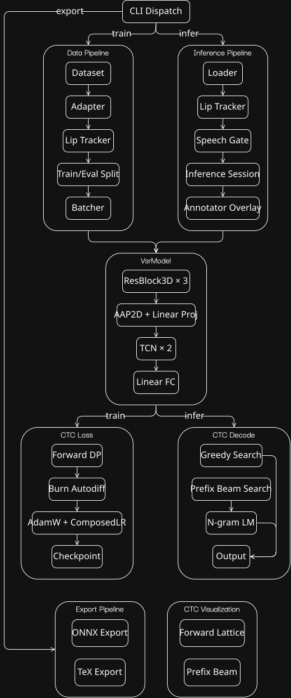
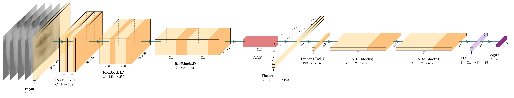
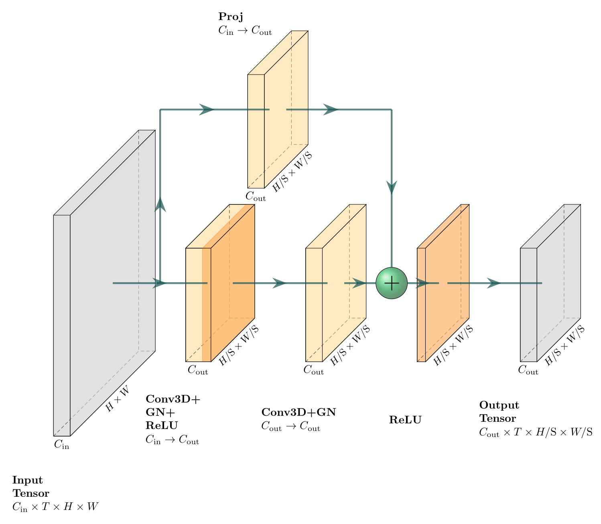
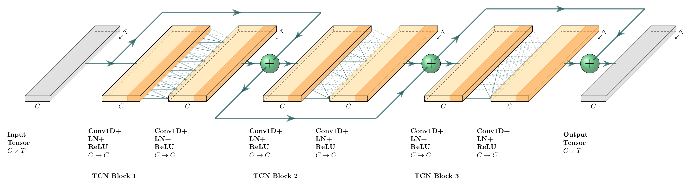
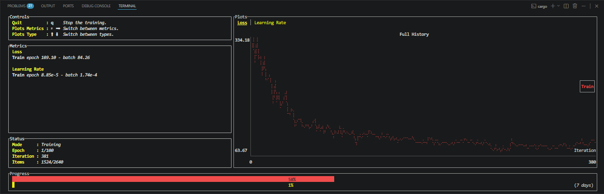
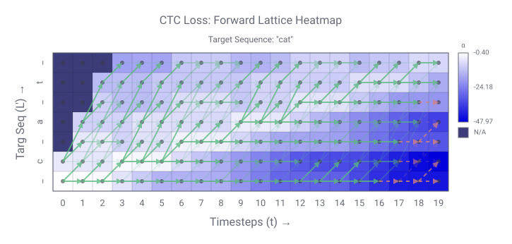
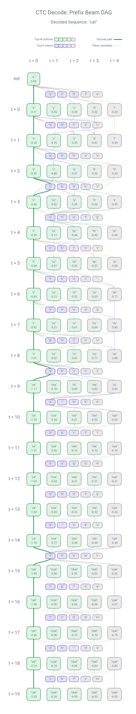

<!-- This is the file for providing the narrative -->
<!-- Rule of thumb for what goes here: "Is this explaining my engineering journey?" -->

<!--
Editorial conventions for this Markdown source LRM portfolio article (for any potential future contributors)

Document shape
  • Hub: Situates the whole project for a reader who has not read the code. This includes scope, how the pieces connect, and what is claimed (and not claimed) about outcomes. Should favor a single, readable pass at “what this is” and “what runs”, while reserving detail and variants for the spokes.
  • Spokes: Carries mechanism, trade-offs, and implementation details. Certain hubs and spokes may overlap in topic, but the hub should stay a thin orientation portion. Spokes may be revised or extended as the work evolves (such as new datasets or phases) without rewriting the whole article.

Voice
  • Mixes clear explanation with case-study narrative where it helps. Hub sections may be slightly more conversational, whereas spoke sections should pair short setup with scannable structure (short paragraphs, lists), not a wall of bullets or a single long essay.
  • Each spoke section should read as a contained story: what the problem was, what was tried, and what was kept.

Pronouns
  • Motivation, hurdles, and spoke sections: first person I / my as the maintainer’s account.
  • High-level pipeline overview: inclusive we / our as a walkthrough of the system. This contrast with first person elsewhere is a valid intentional consistency.

Formatting
  • Proper names and acronyms: capitalized as usual (Rust, Burn, GRID, LRS, VSRM, CTC, GPU, LM, CPU, and so on).
  • Markdown headings: sentence case for ## and ###. Use title case or branded phrasing only where it reads as a named label in prose (such as “The Kitchen Prep”).
  • Colons: if the clause after a colon continues the same sentence, start with lowercase. If it begins a new sentence or a titled field (label–value blocks), start with a capital letter. Stay consistent within a section.
  • Source layout: indent nested structure in the markdown with four spaces per level so it is easy to scan in source—this applies to nested list items, raw HTML (for example tables), and other hierarchical blocks.
  • Fenced code blocks: keep the opening and closing fence lines (triple backticks) flush left. Indentation inside a fence is whatever the snippet needs for valid code.
  • Backticks: Wrap literals like `TokenMap` in backticks.
  • Bolding: in lists/definition-style blocks, bold the label before colons. Keep narrative signposts like `The goal: …` plain. Otherwise use bold sparingly (contrast, warnings).
  • Italics: in running prose, italicize the first use of standard ML terms (e.g. *tokens*, *logits*, *learning rate*, *batch size*, *epochs*, *loss*, *blank*, *decoder*), and close kin on first use (*weights*, *hyperparameters*, *objective function*, *vocabulary*, *tensors*). Subsequent repeats and obvious variants (e.g. *tokenization* after *tokens*) stay plain. Optional light *voice* stress in hub or hurdles, very sparingly. No italics in code fences or backticks.
-->

<a id="top"></a>

# LRM Portfolio Article

## Series navigation
- [Hub — main article](#main-high-level-hub-article)
    - [Motivation](#the-motivation-the-why)
    - [Overview](#the-high-level-pipeline-overview-the-what)
    - [Hurdles](#the-hurdles-along-the-way)
    - [Results](#the-current-results)
- [Spokes — secondary articles](#secondary-low-level-spoke-articles)
    - [Part 1 — Data pipeline](#part-1--data-pipeline)
    - [Part 2 — Neural architecture](#part-2--neural-architecture)
    - [Part 3 — Training / CTC Loss](#part-3--dl-training-framework)
    - [Part 4 — Inference / CTC Decode](#part-4--cv-inference-framework)
    - [Part 5 — CLI & export](#part-5--cli-design-and-usage)

---

<a id="main-high-level-hub-article"></a>

## The motivation (the why)
**Header**: Building a Visual Speech Recognition System in Rust from the Ground Up

**Tagline**: Tackling the tradeoffs of building ML infrastructure outside the Python ecosystem

**Body:**

Deep learning frameworks are heavily dominated by Python as of the time of this writing. Although Python is well-established in the ML industry and for research purposes, when it comes to deploying real-time, low-latency systems for tasks like processing 25 FPS video for visual speech recognition, it’s likely going to end up requiring heavy runtimes and parallelization.

For this project, I wanted to test the waters with whether or not I could build a complete real-time Visual Speech Recognition Model (shortened to VSRM from here on) entirely in a systems-level language. I chose Rust – with Burn for the deep learning framework and OpenCV (Rust bindings) for the computer vision tasks – because such a stack can offer me a whole list of things like: robust memory safety, high control over threading/concurrency, low-latency runtimes, backend abstraction, and single-binary deployment, all without Python's GIL (Global Interpreter Lock) getting in the way.

But at the same time, using Rust inevitably won't come without its downsides either. With the primary tradeoffs being research velocity and library surface, Python wins on turnkey baselines, where ecosystems like PyTorch offer copy-paste starting points such that the setup towards the first loss curve is hours away, rather than days. The CV and ML tooling stays far more off-the-shelf there than with today's Rust.

With that context set, everything that follows documents what I've built thus far, how the full system actually pieces together, and the journey it took to get there. Let's walk through each piece, starting with the high level overview below.

---

## The high-level pipeline overview (the what)

<p align="center">
    
</p>

The goal: Build a neural network model trained to recognize visual patterns from video clips of someone speaking and predict the text of what they said (without the helping hand of audio). Everything below exists to make that happen.

---

### 1. The Kitchen Prep (Data Pipeline)

Before our model sees anything, the raw data needs to be wrangled into shape. Now in supervised learning, we work with pairs: the "inputs" (what the model sees) and the "targets" (what we want it to learn to predict). In our setup, the inputs are video frames of someone speaking, and the targets are the text transcripts of what they said.

The problem is that raw datasets are messy. Different sources pack their files differently, videos vary in framing and resolution, etc. But our model really only cares about one thing: the mouth.

So our data pipeline handles four jobs:
- normalize different filesystem layouts into a standard format,
- tokenize the text by chopping the transcripts into bite-sized pieces called *tokens*,
- run a lip tracker to crop each frame down to just the mouth region,
- and then batch everything into padded, GPU-ready tensor payloads.

Here, think of tokens as the atoms of our set vocabulary. The computer wouldn't know what the letter "h" is, but it does know numbers. So we map every character (letters and spaces) to a specific ID. By converting something like "hello" into a sequence of tokens, we can turn abstract text into a numerical format the model can actually digest.

By the time the data reaches the model, it is a clean, consistently-shaped stack of mouth patches (represented as raw pixels) paired with their transcripts (as character-level token IDs).

---

### 2. The Brain (VSRM)

We then feed the video frames into the VSRM. But the model doesn't see "words" yet, rather, it sees visual patterns instead. At this stage, it just tries to look for shapes and movement.

Under the hood, the model has three parts:
- **The Eyes (spatial frontend):** This part handles the "where". It looks at each frame one by one, and learns to pick out features like lip shape, teeth visibility, or even tongue position from the raw mouth crop.
- **The Memory (temporal backend):** This part handles the "when". It looks at the history of accumulated frames as timesteps, and learns to connect those spatial snapshots into motion patterns such as the transition from an open mouth to a closed one, the timing of a lip rounding, and so on.
- **The Guessing Game:** This part handles the "what". For every tiny moment of the video, it maps those time-based patterns into a giant list of guesses as per-frame character scores called *logits*.

The results from the model are these logit outputs. Think of it as the model shouting out which letter it thinks it sees at each frame (like "I'm 90% sure this frame is an 'O'!").

---

### 3. The Dojo / Learning Guide (Training / CTC loss)

The blank trick: To help the computer, we introduce a *blank* character to our established vocab (we use "_").

**Why we need it:**

- **Reason 1:** If the model outputs something like “...ll...”, we need a way to know if that is one “l” held for two frames, or two separate and deliberate “l”s inherent in the word's spelling (like in "hello"). Here, the blank acts like a divider. “l_l” means two letters, while “ll” just means one long sound.
- **Reason 2:** If the speaker isn't talking (pausing, mouth briefly closing, stopping to take a breath), the blank gives the model something to output as a placeholder.

During training, the model might guess something along the lines of "hhhh__eeeee_lll_ll_oooooo".

The problem is that the video might have 25 frames, but the word "hello" only has 5 letters. How does the computer know which frames match which letters?

This is where CTC loss comes in. It serves as the mathematical guide we set for the model (called the *objective function*), and works by calculating all possible ways "hello" could fit into those 25 frames. From that, it tells the model: "Adjust your weights so that some combination of these frames equals 'hello'." We use CTC loss as the judge during the training loop to tell the model how wrong it was – with that measured wrongness being the loss.

While the model learns to adjust its own *weights* (which are like thousands of internal knobs that represent the importance level of certain learned features), the human controls the *hyperparameters* (the external settings that define how the model learns), governing things like the *learning rate* (how big of a step the model takes when correcting its mistakes) or the *batch size* (how much data it looks at before making a weight adjustment).

This loss-adjust-repeat process runs thousands of cycles (called *epochs*) across the dataset, with each pass nudging the model's weights just a bit until the model's guesses become more and more accurate and the loss is minimized. Once this loss converges to a low enough level and the model stops making big mistakes, we can then save the trained model and switch to evaluation mode. From there, we can feed it a video it's never seen, and check what it predicts.

---

### 4. The Arena / Smart Filter (Inference / CTC decoder + n-gram LM)

Behind the scenes, what the model's guesses actually look like for every frame aren't actually single winners, but instead rows of scores distributed over our full character set.

During evaluation, the model emits those per-frame logits or scores for a new video it has never seen in a manner similar to:

<div align="center">

|  Frame  | 'h' | 'e' | 'l' | 'o' | '_' | ... |
|:-------:|:---:|:---:|:---:|:---:|:---:|:---:|
| Frame 1 | 80% |  8% |  3% |  2% |  4% | ... |
| Frame 2 | 81% |  7% |  4% |  2% |  3% | ... |
| Frame 3 | 82% |  6% |  4% |  2% |  3% | ... |
| Frame 4 | 85% |  5% |  3% |  2% |  2% | ... |
| Frame 5 |  4% |  6% |  5% |  3% | 70% | ... |
| Frame 6 |  3% | 92% |  2% |  1% |  1% | ... |
|   ...   | ... | ... | ... | ... | ... | ... |

</div>

That's one row per frame for the entire clip. The problem this time is that even after picking the most likely character(s) at each row, what comes out is something like "hhhh__eeeee_lll_ll_oooooo", which is quite messy and repetitive.

This is where the CTC *decoder* comes in. It acts first as a selector by choosing the best character output(s) at each row and then as a filter that refines this output by collapsing/skipping repeated characters (turning "hhhh" into "h") and stripping blanks (turning "lll_ll" into "ll"), such that what's left is a cleaner output sequence.

One extra measure we can add on top of this is a *language model*. During selection, if the decoder is torn between "hellow" and "hello," this language model can step in and act sort of like an English teacher, nagging the decoder: "In English, 'hello' is much more common than 'hellow'."

This select-filter process runs row by row across the score table, with the decoder maintaining its best selections as it sees more rows. Once the full table has been processed, what comes out the other end is a clean text output "hello" from nothing but a video of someone talking.

---

### 5. The Big Picture

And that's (more or less) the condensed end-to-end story: video data goes in, VSRM learns, clean text predictions out. Although this overview highly simplifies the full pipeline, the spoke sections further down go deeper on each piece regarding the architecture decisions, the CTC math, the inference infrastructure, and the CLI that wires it all together.

Quick note: My training runs are still in early stages on a controlled corpus, so results are preliminary. For now, the focus is on the engineering story.

---

## The hurdles along the way

Though as streamlined as the above pipeline overview makes it seem, getting to the phase of a full working preproc/train/eval/export suite was an ongoing battle with the realities of building in a nascent ML ecosystem. There were many days spent in cycles of experimentation and iteration, but below are some of the major highlights:

---

### 1. Iteration/ecosystem tax

When you build an ML pipeline in Python, there's usually already a well-trodden conventional way to handle data. But in Rust, I found out that you often have to pave the road ahead before you can drive on it. Many design commitments will happen, and in the same vein, many walk-backs may equally happen as well.

Early on in the project, I had committed to an ad-hoc data path design for the GRID dataset, which I later scrapped and rewrote into standardized split and batching foundations, along with a dedicated dataset adapter system, as I determined that this would be a better systems-wise design.

During this same pivot, I also recalled making an earlier naive choice of computing per-sample video pixel normalization stats in my data preprocessing. The problem was that giving each sample its own zero-point undermines the globally consistent distribution the model needed to learn from. As time went on, I started to develop the concern that this approach was not the right call, so I restructured preprocessing to both compute and cache global normalization stats across the dataset instead. It was here that I had the concrete reminder of how tightly a trained model is coupled to the dataset it was trained on.

**The takeaway**: For every feature, plan from the top down. Additionally consider how that feature would sit with the overarching system by thinking about what the system would need from that feature and likewise, how that feature would fulfill its purpose for the system.

See [Part 1 — Data pipeline](#part-1--data-pipeline) for more details.

---

### 2. Early training loss plateaus

With the Burn Learner framework for training setup and the data finally able to flow, this was where the heavy diagnostics began. I hit my first major training wall when the loss curve was stubbornly flatlining each run. In a deep learning project, a flat loss curve is probably the most frustrating type of failure, since the code is technically running, but the network isn't developing.

I eventually managed to narrow the problem down to the learning rate (LR) scheduler that I was using, which was effectively pinning the step size near zero due to an erroneously documented scaling parameter in the framework that I mistook as something else.

My replacement was to opt for a warmup phase (ramp up so early updates aren’t excessive and counterproductive), combined with a decay later on. The catch was that when I moved to Burn's Composed scheduler to enable this, I expected a sequential relay-type behavior, where it would be like a handoff from one scheduler to another. It turned out that the story was way different and that it instead worked like a signal mixer that blended them. So I had to configure it as a product of a ramp and a decay rather than a sequential ramp-to-decay activation. From this, the learning rate curve finally started to take the shape I wanted, and the loss at long last started moving.

**The takeaway**: Oftentimes, implementing a thing in a developing framework involves a much higher observability tax. You have to transition from a set-and-forget mentality to a verify-all-assumptions one.

See [Part 3 — Training / CTC Loss](#part-3--dl-training-framework) for more details.

---

### 3. CTC blank collapse outputs

When I got the loss to finally start moving, I then ran into a problem where, even though the loss was decreasing and the training time was long (high epochs), the model outputs were consistently filled with the CTC blank token for almost all frames/timesteps.

Although for early training epochs, I recognized high blank outputs as an expected outcome, since the model had not learned meaningful feature-to-morpheme patterns yet. But with this phenomenon still occurring at high epochs further into training, I interpreted this as the model figuring out that the mathematically safest way to minimize loss all-around was to confidently predict the blank token for virtually every frame.

My first attempt was more of like a quick band-aid in that I tried biasing the blank logit to be lower upon initialization, so that in theory, non-blank characters at least had a fighting chance to compete. That only softened the problem, as the model then just shifted the issue towards outputting all-same character tokens at high epochs. By this point, I suspected that the issue was structural and decided to rework the spatial frontend chain and add a more graceful bridge between the frontend and the temporal backend.

With these changes, the VSRM was finally able to stop cheating and actually start converging more meaningfully at later epochs.

**The takeaway**: A decreasing loss is a necessary but insufficient metric for success. If the loss is dropping but the model's performance is still poor, assume the model has found a shortcut that bypasses the actual learning objective.

See [Part 2 — Neural architecture](#part-2--neural-architecture) for more details.

---

### 4. Silent data starvation

Perhaps the most elusive roadblock was a data-loading bug that made training look deceptively fast. Initially, my epochs were finishing in minutes, which I blindly took this as a baseline. Yet, I eventually discovered a massive mismatch in the raw GRID dataset. For some reason, many speaker video directories held data entries that didn't align with their corresponding transcript directories, causing my file-stem checks in my dataloaders to result in a huge fraction of the data being skipped. So the "fast" training I had been celebrating was actually just the model starving on incomplete data.

After incorporating a full-on dataset adapter module to correctly map and align these "jumbled" pairs, the true scale of the project hit me when I launched the next training runs again. Each epoch went from 20-minute sprints to hour-plus marathons.

**The takeaway**: Metrics are only as honest as the data that feeds them. In a complex system, the absence of an error message is not a confirmation of health, and similarly, a silent success is often more dangerous than a loud crash.

See [Part 1 — Data pipeline](#part-1--data-pipeline) for more details.

---

### 5. External Burn API bug

It was after those longer training runs that I decided to incorporate subset sampling from the full on-disk dataset (and then partition into train/val/test splits from that subset instead), plus a checkpoint save/load feature for the model weights to allow for stopping mid-training and resuming later.

Because of my previously mentioned choice of using the Composed Cosine and Linear LR schedulers, which is exactly where Burn 0.20.1 bit me when I found out that checkpoints could mis-serialize the Cosine match arm of the scheduler. So in practice, I couldn't safely stop, sleep, and continue; as long-horizon training had to be one uninterrupted session. I added this as an issue in the official Burn repo, and it was shortly marked as resolved ([Burn PR #4617](https://github.com/tracel-ai/burn/pull/4617)).

With enough time spent on the project thus far and in fear of losing the current established model behavior if I opted for a different LR scheduler, I was faced with the hard decision to keep the current state and wait for the next stable Burn release. But this also meant that the combination of honest epoch length and a broken resume path capped how far I could push epochs in the current project snapshot.

**The takeaway**: When building on the frontiers of a nascent ecosystem, the framework is less like a tool and more like a co-author of your project. You must account for upstream risk, where the ceiling of your project's results is temporarily capped not by your own logic, but by the maturity of your dependencies.

See [Part 3 — Training / CTC Loss](#part-3--dl-training-framework) for more details.

---

## The current results

Where this project stands today is easier to state at two levels. The first is the foundational layer, which is a working data preprocessing and ingestion system, a training framework with palpable early loss convergence on the GRID dataset, a working inference engine with a swappable mouth tracker, and an exporter for model artifacts. The hard parts are all cast behind and the infrastructure needed for any serious work on the model is in place. My longer-term goal of training on a broader corpus (LRW, LRS2, LRS3) for a more generalized live model is deferred as a phase two ordeal, but the stack is in place to support it when the time comes.

The second level is the model itself, which is still in the "where does the loss curve land long-term" phase. What's confirmed is that the loss makes the usual steep initial descent and then settles into a noisier and shallower regime, and I don't have the epoch budget to say whether that's a definitive plateau or a slow grind that I never ran long enough to validate. The spoke sections below are where I put the implementation details in context, along with the figures and the module-level specifics.

---

<a id="secondary-low-level-spoke-articles"></a>

## Part 1 — Data pipeline

I started with the intention of feeding data into the VSRM for training. But there exist different sources for data of the same modality (video-transcript data for visual speech recognition). These different sources most likely disagree on how they format around that pair (e.g., how clips are named, how transcripts are encoded, whether video and text live in the same folder or in parallel trees, and whether you get one big table or thousands of tiny bundles). One corpus might ship .mpg + .align in a flat speaker tree, another might use .mp4 + JSON captions, a third might shard by date or speaker with different nesting depth.

---

### Data filesystem format standardization

This is where my dataset adapters come in. They hide that surface chaos behind a settled bundle contract that the rest of my stack can trust. With these various source-specific adapter modules implemented, I could then take the data from any source of interest and have its file structure normalized to an established standard format. This way, my stack can be source-agnostic so that anything that's reshaped into my bundle contract can ride the same pipeline path without issue.

Currently, that contract is exercised end-to-end on the [GRID Audio-Visual Speech Corpus](https://zenodo.org/records/3625687), through the `adapters/grid/grid_adapter.rs` module. The GRID corpus includes ~34k entries of short command-color utterance .align files paired with fairly uniform duration .mpg clips of up to 34 studio-recorded speakers (speaker 21 is absent from the release I used, so 33 present speakers). My choice of this dataset was due to it being publicly available and self-contained. I was originally looking toward broader corpora like the Oxford-BBC LRW, LRS2, and LRS3 datasets for better model generalization, but accessibility and realistic scope bounds pushed GRID into the role of reference implementation.

In this case, I decided the data filesystem contract would be sharded .mp4/.txt video-transcript dir bundles. To be more precise:

```text
data/
└── <dataset-name>/
    ├── <shard_1_id>/
    │   ├── <data_entry_1_id>/
    │   │   ├── <stem_id>.mp4   ← normalized video clip
    │   │   └── <stem_id>.txt   ← normalized transcript
    │   │   ⋮
    │   └── <data_entry_N_id>/
    │   ⋮
    └── <shard_N_id>/
```

So for example, a GRID corpus speaker s1 saying utterance `bbaf2n` would have a video file `bbaf2n.mp4` alongside a transcript file `bbaf2n.txt` that both live under `data/grid-lr-corpus/s1/bbaf2n/`. Every dataset source gets its own adapter that wrangles its raw layout into this shape, after which the rest of my data pipeline (batching, training, inference) can treat all datasets identically.

After I had normalized the data's filesystem layout for I/O, I was faced with a new problem: preprocessing the data itself into a unified representation for what the model gets to "see".

---

### Dataset cataloging and sample loading

Once the bundle layout is trustworthy, the next job is to turn those disk entries into an enumerable list of training rows. In code for GRID, that is `GridDataset` in `adapters/grid/grid_dataset.rs`. It scans `data/grid-lr-corpus/`, collects valid utterance keys as `speaker/utterance` strings, optionally applies a reproducible subset draw (`active_subset` as a `(fraction, seed)` pair) from the total dataset on disk, and hangs on to a shared `TokenMap` so transcripts become integer targets. This `TokenMap` serves as a single source of bidirectional char-to-ID mapping, based on an established vocabulary set defined in `vocab.rs` so that every component in the stack can agree on the same character ID convention to prevent vocabulary drift.

Now during training, I discovered a GRID-specific quirk where in practice, it can ship video and transcript trees that don't share the same utterance stems per speaker, so a simple video-transcript stem match can fail silently for many entries in the form of `None` returns from my dataset's `get` method. In Burn 0.20.1, it uses something called a batch dataloader iterator, which works by pulling entries in from `get` – as long as that getter is returning `Some`, otherwise the iterator ends all entry ingestion for that epoch pass. The practical resulting symptom of all this was model under-feeding during training and quicker ending epochs where most of the data was being skipped. This prompted me to incorporate two things: one was to incorporate helpers in the GRID-specific `adapters/grid/grid_adapter.rs` module which works to fix the video-transcript mapping per speaker up front; and another was to implement a `try_load` helper that my original getter method could wrap over so that it can keep pulling until a valid data entry is found, which should now keep returning `Some` until a full exhaustion over the range of the dataset has occurred instead of a premature `None`.

---

### Video mouth crop pre-extraction

The core issue here is that raw video frames are noisy and inconsistent. Different speakers sit at different distances from the camera, framing varies, and the model really only cares about one small region: the mouth. Feeding full video frames would just bury the signal in extraneous background clutter and make the model's job unnecessarily hard.

My solution is a lip tracker, implemented behind a `LipTrackerBackend` trait in `tracker.rs`. My choice of a trait here keeps tracker backend implementations swappable to leave the door open for future trackers (such as a landmark-based backend like MediaPipe) being able to be plugged in without touching the rest of the codebase.

For each frame, the configured backend locates the face, then zooms into the mouth region, crops and resizes that region to a fixed target size, and lastly converts the frame to grayscale (color adds two extra channels of data without contributing any meaningful lip-feature information, so it's just extra work for the model). This provides the model a clean, consistently-framed/sized mouth patch instead of a full scene. The crops are then cached to disk (`cropped_frames/`) as pre-extracted tensors so training can load them to the model directly and skip re-running the video decoder and tracker on every epoch.

I went with a Haar cascade tracker in OpenCV here (implemented as `HaarTracker` in `haar.rs`), as I thought it's fast enough to run on every frame without becoming a bottleneck across tens of thousands of corpus entries. But, the tradeoff is that Haar is sensitive to face tilt and harsh lighting, so I realized it's not the most robust option for anything beyond a controlled-conditions corpus like GRID.

---

### Preprocess trace

The preprocess subcommand runs the GRID adapter pipeline in order: align (validate and print any video-tree vs alignment-tree speaker mismatch), bundle (move into per-speaker per-utterance folders using that mapping), normalize (standard mp4 and txt with a progress bar), clean (drop redundant legacy files once each utterance has the new pair), then constructs the dataset handle and pre-extracts mouth crops into the corpus crop cache directory.

Below is a representative preprocess trace on a 2k-sample subset (not the full corpus):

```text
Discovered speaker mapping (video -> alignment, non-identity): [("s10", "s13")]

Bundled GRID utterances into speaker/utterance dirs (moved 2000 files)

Standardizing GRID corpus for 2000 samples...
  [00:04:21] [####################################] 2000/2000 (GRID standard-format pass finished (.mp4 / .txt, idempotent per file)) (ETA: 0s)

Clean corpus: removed 2000 redundant file(s)

Initialized GridDataset: 2000 samples from speakers ["s1", "s10"]

Pre-extracting GRID mouth regions for 2000 samples...
⠒ [00:03:48] [##########################>-------------] 1309/2000 (s10/lbwh6p) (ETA: 6m)
```

Reading down: the first line is a video-to-transcript mapping-only diagnostic (no renames there). The next line is the bundle step applying that mapping, so each utterance sits under one speaker folder with paired media and text. The "standardizing" block plus the "clean" line are the normalizing, then tidying steps. The initialized line is a fresh scan of bundled rows. The pre-extracting block is the tracker writing crop cache entries, with the spinner line showing how far through the list that pass has reached.

---

### Dataset partitioning

Next up is handling the dataset train/eval splitting. I created a source-agnostic `DatasetSplit` wrapper, where the dataset gets shuffled and split into train, validation, and test partitions over a given subset of the entire data on disk. The shuffle is deterministic so that with the same seed, I get the same splits every run and validation numbers stay relatively comparable across experiments without worrying about lucky data draws.

With partitioning out of the way, the remaining data pipeline steps are about getting the data into the model in the right payload format, with the correct tensor shapes.

---

### Batching

Now when the training dataloader asks `GridDataset` for a sample by index, `GridDataset::get` returns a single standardized dataset entry as `VsrmItem`. That load path either reads pre-extracted crops from `cropped_frames/` (the `.bin` cache produced by the pre-extract pass) or, if those tensors are not present yet, decodes the normalized `.mp4` and reuses the tracker-backed crop pipeline from the mouth-crop step (so behavior matches the pre-extract before the cache exists).

```rust
// C = number of color/feature-map channels (1 for grayscale)
// (H, W) = height/width frame dimensions

// T = video duration as number of timesteps
// L = transcript sequence length

pub struct VsrmItem {
    pub frames: TensorData,          // [C, T, H, W]  frames of the video (as TensorData to avoid Backend binding)
    pub transcript_ids: Vec<usize>,  // [L]           sequence IDs corresponding to speech in video
    pub item_id: String,             // ID of data sample
}
```

Then comes batching. I designed the model to expect data in the form of batch payloads consisting of padded video input / target transcript sequence tensors, along with original input/target length tensors. Now, GPUs expect data tensors to be rectangular. Since every utterance in the dataset is not guaranteed to be the same length (a short clip might be 20 frames, a longer one 75), I can't just naively stack them into a tensor (even though the GRID dataset videos are largely uniform length). The `VsrmBatcher` collects a mini-batch of the variable-length input videos and target transcript sequences inside each `VsrmItem`, finds the longest duration video and longest spanning transcript sequence in the group, and pads the other shorter entries up to that length: video frames get zero-padded, transcripts get padded with the special CTC blank token (see [CTC loss](#ctc-loss) in Part 3 for more details about CTC and the importance of the blank token). However, because the model has no way of distinguishing the real data from the dummy padding, the batch also carries the original unpadded input/target length info along with it. This way, the subsequent loss function and decoder know exactly where to stop paying attention such that the blank token doesn't get processed.

After collation, everything for one training iteration is carried in a single `Batch` (see `VsrmBatcher` / `Batch` in `LRM Rust/src/pipeline/batcher.rs`): padded tensors for the stack, plus per-sample lengths.

```rust
// N = batch size
// C = number of color/feature-map channels (1 for grayscale)
// (H, W) = height/width frame dimensions

// T = video duration as number of timesteps
// L = transcript sequence length

// T_max = longest video duration in the batch
// L_max = longest sequence length in the batch

pub struct Batch<B: Backend> {
    pub inputs: Tensor<B, 5>,              // [N, C, T_max, H, W]  padded frames (as f32 pixel values)
    pub targets: Tensor<B, 2, Int>,        // [N, L_max]           padded transcripts (as usize token IDs)
    pub input_lengths: Tensor<B, 1, Int>,  // [N]                  original lengths before time padding
    pub target_lengths: Tensor<B, 1, Int>, // [N]                  original lengths before sequence padding
}
```

Under the hood, each video is stored as a flat contiguous buffer of raw `u8` pixel bytes (one grayscale value per pixel), with each frame laid end-to-end as a 1D `Vec`. This flatness keeps the representation compact and avoids nested allocation overhead (no `Vec<Vec<u8>>` nesting, with outer vec as frames, and inner vec as frame pixels). The choice to stay in `u8` all the way through extraction and caching is a deliberate one, as it's 4x smaller on disk than `f32`, which adds up fast across tens of thousands of cached crops.

Concretely, the bytes are just row-major grayscale samples (top row first, left to right), with each timestep’s `H × W` patch concatenated in time. For illustrative purposes, the numbers below are dummy values for two frames on a toy `3 × 4` crop so the layout is visible; real crops use the tracker’s target `H` and `W`, but the contiguous pattern is the same:

```rust
// C = 1, T = 2, H = 3, W = 4

// readable layout:
let mouth_clip_u8_blocks: Vec<u8> = vec![
    // frame t = 0
    12,  18,  22,  19,
    45, 120, 118,  52,
     8,  14,  16,  11,

    // frame t = 1
    10,  20,  24,  17,
    50, 115, 110,  48,
     9,  12,  15,  13,
];

// realistic layout:
let mouth_clip_u8_flat: Vec<u8> = vec![12,  18,  22,  19, /* ... */, 9, 12, 15, 13];
```

---

### Video pixel normalization

Pixel values are then normalized to zero mean and unit variance using stats computed once across the full dataset (or data subset). The tradeoff is that this normalization (zero-mean, unit-variance) has to happen at batch time rather than being baked into the cached files. But that's actually a feature since it means the crop cache is reusable regardless of which normalization stats you're using, and you can swap between global dataset stats and per-sample fallback normalization without re-extracting anything.

Now this is one of Burn's standout features. Burn's framework is built around a generic `Backend` trait.
During my collation phase when batching, the `u8` buffers are loaded, cast, padded, and assembled into sample-wise tensors on the CPU using Burn's `NdArray` backend. Once the batch is fully stacked as a single, uniform payload, the tensors are then cast to the `Wgpu` backend. The resulting flow is a single, massive contiguous host-to-device transfer that moves the data to the GPU for the subsequent model forward pass (avoiding PCIe overheads), rather than the per-sample transfers of having the sample-wise tensors being a `Wgpu` backend upfront.

---

## Part 2 — Neural architecture

Visual sentence recognition has a fairly stable macro-shape: crop the mouth, run a spatiotemporal encoder, map frames to a character distribution with a sequence model, and train with CTC as the loss function (or, in other lines of work, attention/seq2seq). Classic end-to-end pipelines like LipNet made that CNN–RNN–CTC pattern familiar on the GRID corpus. Later systems often kept the same skeleton but swapped the temporal trunk (for example, Zhang et al. (2021) replaced the heavy RNN layers with a Temporal Convolutional Network (TCN) while still decoding with CTC).

Across my Rust code, I tried following Burn’s design philosophy by having a small `…Config` type (serializable hyperparameters and an `init()` constructor), and a separate base module struct that actually holds tensors so the VSRM stack, CTC loss, decoders, and training knobs stay consistent with the rest of the ecosystem instead of inventing one-off design-inconsistent constructors everywhere.

---

### Main model (VSRM)

My VSRM follows in the footsteps of this established blueprint. As such, the core challenges of this project were less about inventing a novel architecture, but more so on how I could instantiate this template from scratch in the Rust/Burn framework, and whether or not I could still achieve similar results when I stress-tested it.

With the mouth crops and padded batches coming out of Part 1's pipeline, my next job was to turn the input fields from those batches into a per-frame score over characters. The batches have inputs shaped as `[N, C, T, H, W]`, and the model has to turn a short clip of mouth pixels into a sequence of character scores at every frame. I kept the layout straightforward: a spatial frontend that grows functional local features, a fixed-size bridge so the temporal trunk always sees the same vector width, a causal temporal backend sized for live inference, and a linear head for CTC logits.

The macro PlotNeuralNet export below matches that end-to-end path:

<p align="center">
    
</p>

Figure 1: The Macro VSRM (`vsrm.rs`). The network forwards data through three spatial ResBlock stages (time axis implicit in the spatial frontend layers), compresses with adaptive average pooling over `H × W` and a linear projection, processes time sequentially through two TCN stacks, and outputs character probabilities through a fully connected vocabulary head (vector [PDF](assets/vsrm_viz.pdf)).

---

### Spatial frontend (ResBlock3D)

My frontend consists of three stacked, custom 3D residual blocks (`residual.rs`). Each block has two `Conv3D` layers with `GroupNorm` and ReLU, plus a residual path. When channels or stride change, the skip uses a `1×1×1` projection so the add stays shape-correct. I use strided convolutions on height and width rather than a spatial `MaxPool3D` stack so downsampling stays learned rather than a fixed max-pool grid.

Channel width follows a pyramid (by default `128 → 256 → 512`) so later layers can carry richer spatial features without starting huge on the raw input. That replaced my earlier iteration of squeezing width mid-stack in a “diamond” sort of structure (`128 → 256 → 64`), which made optimization harder in practice.

**Why GroupNorm here:** video batches are often small. `BatchNorm`’s running statistics get noisy, and slapping `LayerNorm` across the full 5D tensor would mix too many axes at once. `GroupNorm` normalizes within channel groups per `(H, W)` location and time step, which behaved more predictably for this stack.

The following PlotNeuralNet export shows my custom ResBlock3D component:

<p align="center">
    
</p>

Figure 2: A ResBlock3D component (time axis implicit). The main path forwards spatial features through two Conv3D/GroupNorm sequences, while the upper skip connection uses a 1×1×1 convolution to align tensor dimensions before the final element-wise sum (vector [PDF](assets/rb_viz.pdf)).

---

### Space–time bridge (AAP2D + projection)

After the third block, the model is still carrying a tensor with a wide `H × W` grid per timestep. Feeding that straight into a 1D temporal net meant the TCN’s input width would be coupled to crop resolution and depth in a brittle way. So instead, I reshape so each frame is its own 2D map, then run adaptive average pooling (fixed `4 × 4` spatial output), flatten it, and apply a linear projection into a fixed `hidden_dim` (default `512`). This boundary should, in principle, give the temporal trunk one stable and compressed vector per frame that's independent of the exact `H × W` after striding, as long as the crop meets the minimum size the frontend assumes.

---

### Temporal backend (TCN)

The backend trunk consists of two temporal convolutional networks in sequence (`tcn.rs`). Each TCN layer consists of a stack of TCN Blocks (default config uses four blocks per layer, but in my initialized model, I use three blocks), with each block containing two causal, dilated `Conv1D` layers. Across each block are dilation steps `1 → 2 → 4 → ...`, so receptive field (the effective temporal lookback range) grows without turning the whole pass into a recurrent hidden state. `LayerNorm` is applied per time step over channels, with the tensor temporarily in `[N, T, C]` form (not `GroupNorm` across the time axis so normalization does not leak future frames into the norm statistics, which matters in my case, since I want strict causality for sliding-window inference).

The following PlotNeuralNet export shows my TCN component:

<p align="center">
    
</p>

Figure 3: A TCN component stack (time axis pointing out of the page – or rather, diagonally towards the bottom left). The temporal trunk forwards temporal hidden states through blocks of two causal dilated Conv1D layers with incrementally increasing dilations 1, 2, 4 (3 blocks), causal per-timestep LayerNorm, dropout, and pointwise projections on the residual between each block (vector [PDF](assets/tcn_viz.pdf)).

I defaulted to using a TCN over a bidirectional LSTM/GRU for fast throughput and simpler deployment because conv over time parallelizes well, and there is no separate “carry” state to thread through live paths beyond the finite receptive field.

---

### Final readout and QoL additions

The final readout is a single fully connected layer to vocab-sized logits per timestep (`[N, T, vocab]`). My implementation also allows an optional blank logit bias during initialization so the blank class does not instantly swallow the rest of the character distributions at step zero.

Below is the full tensor shape flow for one batch forward. Defaults match the stock config: grayscale input with `C_in = 1`, ResBlock channels `128 → 256 → 512`, `hidden_dim = 512`, adaptive average pool to `4 × 4`, then flatten to `512 × 4 × 4 = 8192` before `proj`, and logits over vocabulary size `V`.

```text
input                       [N, C_in, T, H, W]
ResBlock3D 1                [N, 128, T, ⌊H/2⌋, ⌊W/2⌋]
ResBlock3D 2                [N, 256, T, ⌊H/4⌋, ⌊W/4⌋]
ResBlock3D 3                [N, 512, T, ⌊H/8⌋, ⌊W/8⌋]
dim swap + reshape          [(N·T), 512, ⌊H/8⌋, ⌊W/8⌋]
AAP2D                       [(N·T), 512, 4, 4]
reshape                     [N, T, 8192]
Linear (proj)               [N, T, 512]
dim swap                    [N, 512, T]
TCN 1                       [N, 512, T]
TCN 2                       [N, 512, T]
dim swap                    [N, T, 512]
Linear (FC, logits)         [N, T, V]
```

Concrete example for `frame_dims = (50, 100)`. After ResBlock 1, the spatial map is `25 × 50`. After ResBlock 2, it is `13 × 25`. After ResBlock 3, it is `7 × 13`.

At this point, I realized I needed an important value I could trust at inference time: how many past frames the model actually uses once padding and causality are accounted for. So at init, the model prints a temporal receptive field in frames, derived from the combined ResBlock stride and TCN dilation lookback contributions. I set up the inference pipeline to read that same number when it builds sliding windows, so I never hand the model a buffer that is shorter than its real lookback.

After large refactors, I kept second-guessing whether channel counts still lined up, so I banked on Burn’s module visitor path, which can walk the module tree and record per-layer params and I/O shapes. My `SummaryVisitor` (which implements Burn's `ModuleVisitor<B>` trait) in `summary.rs` dumps the same parameter/shape table I used to sanity-check the graph whenever I changed the frontend or TCN width.

---

## Part 3 — DL training framework

With Part 2 in place, my VSRM now theoretically has the ability to turn mouth crops into a tensor of `[N, T, V]` character logit distributions. But a model by itself is just going to spit out noise, so my immediate next task was to figure out how to create the suite to train this model.

---

### Training loop / learner

Starting off, I began with writing a minimal, hand-rolled training loop (currently as `trainer.rs`) just as a proof of concept to show I could successfully orchestrate a forward pass, calculate loss, trigger a backward pass, step the optimizer, etc. It wasn't until all this was wired up that I then found out about Burn's Learner framework. Now with Rust, it doesn’t hand you a Keras-style `fit()` on a silver platter, so the spine of my training path from then on was to migrate to this newly discovered framework.

Turns out, this Learner framework is actually quite handy, as it acts like the grand orchestrator (it owns the epoch loop, drives the optimizer step, checkpoints the model/optimizer state, and runs validation hooks where I can plug in custom metrics), basically handling everything I was doing manually in `trainer.rs`. With all this, I still keep `trainer.rs` around as a legacy reference loop for those earlier experiments, but the runs I care about from then on all go through the Learner integration in a new `learner.rs` module.

Burn’s training API is compartmentalized rather than one blob of hidden states. I wire the VSRM into `SupervisedTraining`, which takes train and validation dataloaders, registers metrics and checkpointing, and launches a `Learner` that holds the optimizer and LR scheduler. The model implements two step traits: `TrainStep` on the *autodiff* model for a full training step (forward, CTC loss, backward, `TrainOutput` with *gradients*), and `InferenceStep` on the inner eval model for validation steps that run the same forward and loss without autodiff—Burn names this trait for inference/validation, not a separate “valid step” type. I bundle logits, targets, and lengths into `VsrmStepOutput` and implement Burn’s `Adaptor` so the built-in `LossMetric` and my CER/WER metrics can plug into the same dashboard without ad hoc glue code.

My learning-rate scheduling strategy is a slow ramp-up followed by a gradual long decay. To achieve this, I use a Burn `ComposedLRScheduler` with a linear warmup that scales a multiplicative gain from `0.01` up to `1.0` across the first epoch's steps, multiplied by a cosine decay that anneals from the configured peak learning rate down to one tenth of that over the full training horizon. The two pieces are combined with `SchedulerReduction::Prod`, so the effective step size at any point is their product.

I created a single `train` entry point free-function in `learner.rs`, which served as an orchestrator. It threads application context into model paths, builds the LR schedule and `Learner`, attaches `SupervisedTraining` with metrics and checkpointing, persists configs between runs, and only then launches. Early on I was tempted to inline all of that next to whatever corpus I had on disk, but as the codebase grew, splitting `create_dataloaders` behind a `DatasetSource` dispatch kept that orchestrator from turning into a massive internal if/else branch every time I imagined another corpus. Currently, my `create_grid_dataloaders` carries the GRID-specific tasks such as: splitting, caching global normalization stats, and wrapping `VsrmBatcher` in Burn loaders, while the match block leaves an obvious seam for the next adapter when I'm (or any successor to the codebase is) ready to stress the same VSRM head on another bundle.

Once the loop is actually running, Burn’s training renderer opens a terminal UI, showing epoch/item counters and a scrolling loss/LR plot so the abstractions above show up as a watchable thing.

<p align="center">
    
</p>

Figure 4: Burn training TUI on a 10% GRID subset (100 epochs configured), epoch 1, around iteration 380 (~58% through the epoch by item count). The loss trace is the expected L-curve with a steep drop from large initial CTC values, then a much shallower segment with batch noise. That tail is often diminishing returns within a single epoch, not by itself the same failure mode as a run that never leaves a high loss band across many epochs (the scheduler story in the hurdles section). I still treat validation CER/WER and multi-epoch trend as the serious read on progress; a flat-looking stretch after ~200 iterations here mostly says the easy alignment gain is already partly spent, not that training is “done.”

---

### CTC loss

The training side uses a method known as Connectionist Temporal Classification (CTC) loss. Since Burn 0.20.1 doesn't have the CTC loss in their `burn::nn::loss` library, I had to resort to creating my own custom CTC loss implementation in `ctc_loss.rs`. This was a whole mini-project in and of itself, as I had very surface-level knowledge on how it worked at the time. But thankfully, there's a Distill article online that goes over exactly how CTC loss worked at a high level ([distill.pub/2017/ctc](https://distill.pub/2017/ctc/)) that I relied on for intuition. I also tried to mirror Burn's usual loss template with `forward()` (containing `Reduction::Mean` and `Reduction::Sum` for batch-wise loss aggregation methods) and a `forward_no_reduction()` (for per-sample loss outputs).

After a week or two of trying to get an implementation going, I finally managed to get my first working iteration and although inefficient with its nested loop approach (looping over batches, then over frames/timesteps, and finally over the modified target sequence), the milestone was in its correctness (validated with some essential unit tests that evaluate correctness on things like single-char sequences, skip transition rule adherence, proper padding vs. true length demarcation, reduction modes, etc.). It wasn't until much later that I tried giving optimization a shot by refactoring my CTC loss forward algorithm to vectorize across the batch dimension and then using masks over tensors.

The hub already introduced the blank token and the “many frames, few letters” mismatch overview, but here the implementation story is long. I wrote a forward dynamic-programming objective in log-space over the blank-interleaved target sequence, with tensor masking for valid sequence and timestep positions. And thankfully, with Burn’s autodiff for gradient tensor ops, I don't need to hand-derive again for the backward pass, leaving me with a forward-only implementation.

---

#### How CTC loss works

The goal of the forward pass is to calculate the total probability mass of all valid ways a frame-by-frame prediction sequence can be condensed into a specific ground truth target text sequence, such that the model can learn to associate the visual features of a video with the transcript without pre-aligned timing info.

The forward pass for my CTC loss implementation boiled down to five important steps:

1. **Sequence augmentation:** we need to first expand the target sequence by interleaving blank tokens (e.g., "CAT" becomes "\_C_A_T_"). With a base target sequence of $L$, which creates a blank-interleaved target sequence of length $2L+1$. We do this so that the decoder during inference-time can distinguish between intentional versus unintentional symbol repeats (such as the difference between "good" vs. "god") in the decoder's collapsing/skip step.

2. **Forward buffer:** we have to maintain a forward time-sequence grid buffer that stores the total log-probability of all paths reaching a specific position $s$ in the augmented target sequence at time $t$. Following the usual CTC notation, $\alpha(t,\ s)$ is the forward log-probability mass at cell $(t,\ s)$.

3. **State transitions:** for each frame/timestep and symbol in the augmented target sequence (time-sequence grid), we'll need to calculate the probability of being at the current state $(t,\ s)$ by looking at three possible previous states:
    - **Stay** $(t - 1,\ s)$: remaining on the same symbol (accounting for repeated predictions).
    - **Advance by 1** $(t - 1,\ s - 1)$: moving from the immediate previous symbol (blank or non-blank) to the current symbol.
    - **Advance by 2** $(t - 1,\ s - 2)$: moving from two symbols back to the current symbol. This is only allowed if the symbol two positions back was a character and if that character is different from the current character (effectively skipping the blank in between them).

4. **Log-probability aggregation:** for each cell in the time-sequence grid, we merge the forward log-probability scores from all allowed predecessor transition states (stay, adv1, adv2) using log-sum-exp (LSE) and sum that resulting value with the model's emission log-probability for that cell at the current timestep. These aggregations remain in log-space to avoid numerical underflow. In my vectorized implementation, the algorithm parallelizes the updates across every symbol position in the modified target sequence per timestep.

5. **Final terminal aggregation:** we finally can merge the last two possible forward state scores (which will be either the final character or the final trailing blank) at the last timestep $T$ using LSE again. Then we can take the negative of that resulting log-probability value and that will be our final scalar loss value.

---

#### CTC forward lattice visualization

The above rundown glosses over how CTC loss works in theory, but it's also word-heavy. And walls of text can't convey much without complementary imagery, so I added a forward-lattice visualizer `forward_lattice_viz.rs` that shares the same DP the training loss uses, but with diverging implementations for SVG-export and ASCII-printout rendering purposes.

The figure below (generated from `forward_lattice_viz.rs`) visualizes the time-sequence grid lattice for an example target sequence. Its cells carry the forward alpha states at each position in the grid. The lattice doesn't show a single best Viterbi path, but rather, each cell is the log-sum of many valid partial alignment paths that end at $(t,\ s)$.

<p align="center">
    
</p>

Figure 5: Forward lattice for an example target sequence "cat", with $T = 20$ columns for timesteps $t$ and $L' = 7$ rows for the blank-interleaved target sequence indices $s$. The vocab size is $V = 28$. The logits are synthetically peaked along the sequence across timesteps to make it obvious which $(t,\ s)$ regions have non-negligible forward mass (along the diagonal) and which are structurally unreachable (the fringes). The color shading of the cells shows the pointwise log-alpha values (with white indicating highest log-alpha, blue indicating lowest, and dark blue indicating unreachable states). The arrows or "edges" show reachability (the valid stay, adv1, adv2 transitions into a cell). Their opacities indicate conditional edge mass as the ratio of the predecessor cell's log-alpha mass to the sum of all predecessors' masses arriving at the current cell. Their color plus their solid/dotted state indicate path validity (an edge is green and solid if it lies on at least one path from the valid start states at $t = 0$ to the valid terminal states at $t = T-1$, otherwise it is red and dashed, indicating that no complete augmented target alignment includes that edge). 

---

### Metrics, optimization, and training dynamics

Although training focuses on minimizing loss from a quantitative aspect, I also need to qualitatively measure progress in tandem with those quantitative loss measures. Beyond loss, the training has to say something about transcription. So I decided to look into incorporating CER/WER metrics into my training suite.

I peeked at Burn’s stock CER/WER initially thinking I could use them for my setup, but I found out they wanted aligned int predictions next to aligned int targets (fixed `seq_len`, pad stripping, then edit distance). But by design, my VSRM hands over CTC logits over time, and the “prediction” that matters is whatever comes out after decoding (blank handling and collapse). So I had to resort to writing thin CTC-aware metrics that take a custom `VsrmMetricInput`, run `CtcDecoder`, unpad targets, and score Levenshtein on the decoded IDs. My WER metric goes one more step and turns those IDs into characters, then splits on whitespace so I measure word errors properly on a per-word basis.

On the hardware side, my early WGPU training runs on Windows were dying mid-epoch, which at first, I assumed it was a bug somewhere in my loop, but I tracked it to VRAM pressure due to batch size (and, on this Windows setup, the display driver’s TDR watchdog when the GPU stayed busy too long). Since I needed an adequate batch size, but couldn't naively use that size without blowing the budget, I resorted to gradient accumulation. This is a method for keeping small per-step micro-batches, and running several forward/backward passes before each optimizer step. With this, I can treat micro-batch × accumulation as the effective batch. The values I used in `main` today without constantly tripping OOM during training for my setup are $4 × 8 = 32$.

As mentioned in [hurdle 5 — External Burn API bug](#5-external-burn-api-bug), the most significant roadblock in this phase for me was an upstream bug I discovered in Burn 0.20.1. I found that the `ComposedLrScheduler` incorrectly serialized the Cosine match arm as Linear in `burn-optim`’s composed recorder, so a loaded checkpoint could restore the wrong LR scheduler, effectively breaking my training suite's "resume from last checkpoint" feature. Since continuous, long-horizon, multi-day training runs on large audio-visual speech corpora like GRID are too infeasible for my case, a working resume path was a hard requirement. I reported the issue to the Burn maintainers (who quickly merged a fix [Burn PR #4617](https://github.com/tracel-ai/burn/pull/4617)), but for the current project snapshot, this bug capped the total training epochs I could feasibly achieve (for a given subset of the dataset), and ultimately prompted me to consider the current status of the project as a systems-level hiatus.

---

## Part 4 — CV inference framework

With a working training framework in place, my VSRM still only outputs `[N, T, V]` logits after training. The eventual objective I need at inference time is to have concrete text outputs for a given timespan. So for my inference pipeline, I need to do the same three things that my training pipeline assumes. These three things are: to keep a stable mouth crop, to hand the model a long enough time window, and to run CTC decode so logits can be converted to text.

---

### Inference loop / predictor

For the inference pipeline, I started from the same constraint that shaped what I had for my training pipeline, with that being the finite causal receptive field of my VSRM (so at any moment, the model only sees a bounded tail of frames). This constraint shows up in two ways. First, in static file mode, I needed to design the system to step through time with a rolling window over the clip, rather than a single monolithic tensor for the clip's entirety. Second, in live cam mode, the camera feed is the same problem – except that there is no future, so I needed to maintain a rolling buffer of the last $T$ frames. With both of these in place, I could then apply decoding to obtain text output.

On the CV side, the tracker and lip crop logic from Part 1 remained as the front door because I foresaw both my training and inference frameworks requiring it (offline crop extractions for training, live cropping for inference), but raw lock and motion scores have the risk of being too twitchy to drive decoding directly. So intuitively, I jumped to the idea of decoding whenever the tracked face box exists, but quickly ran into junk predictions on non-speech states.

So my next idea was to make it so that every `LipTrackerBackend` in `tracker.rs` must implement `has_lock` (which outputs a `bool` indicating if the tracker has a valid lock on the face or not) and `has_lip_motion` (which outputs a `bool` indicating if the speaker in the video is moving their lips). Just as a safety measure, I layered `speech_gate.rs` on top, where it works by counting consecutive frames where both lock and lip motion pass, then flips a "speech active" state with separate on/off thresholds so the gate accounts for possible micro-pauses during speech. When the gate opens, I treat it as a new utterance and subsequently reset the sliding window, dropping stale hypotheses, then resuming with feeding buffers into predict_frames. Conversely, when that gate closes, the buffer is treated as the end of an utterance.

Mirroring the `train` free-function in the training side's `learner.rs`, I have a single `infer` free-function in `predictor.rs` serving as the inference-side orchestrator. It takes an `InferenceSession` (containing the loaded VSRM, decoder, and batching bundle) and a `Context` for resolving tracker-related paths on disk, builds a `TrackerConfig`, and dispatches to `infer_file` when an on-disk input bundle is provided, or to `infer_live` when webcam mode is specified.

For presentation, I have an `overlay.rs` module responsible for layering `FrameAnnotator` (annotates status texts, tracker ROI boxes, and the latest prediction output text) on top of the frames the user actually sees. When I want a shareable artifact instead of a live window, my `annotate_video` helper can burn the same annotations into an output file, and another `mux_audio` helper can stitch the original soundtrack back in for demos, even though the VSRM never consumes any audio.

Lastly, to keep live preview responsive, I split responsibilities across two threads. I have a main thread that owns the OpenCV `VideoCapture` frame grab loop, runs the Haar-backed tracker on each frame, pushes mouth crops into a sliding window, and a HighGUI `LiveWindow` for previewing. Then I have a worker thread that owns a loaded `InferenceSession` (model, decoder, batcher) and does the expensive forward passes plus decoding. My `infer_live` wires that split together with bounded channels in which the main side sends a ready `FramesBuffer` when the window is full (and when the speech gate allows it), and receives back a `String` prediction. This way `predict_frames` never blocks frame acquisition or the preview redraw.


<p align="center">
    <video controls playsinline width="100%" style="max-width: 720px;">
        <source src="./assets/lbij7s_annotated_top.mp4" type="video/mp4" />
        Your browser does not support the video tag.
    </video>
</p>

Figure 6: A representative grayframe video clip output from the inference pipeline's static file mode (s1/lbij7s from the GRID corpus), showing live Haar tracker ROI boxes on the face and mouth, mouth ROI box center point, HUD status lines (tracker lock status, speech activity, and a decoded prediction text line) on the top left, and a picture-in-picture mouth crop inset (showing Sobel gradient magnitudes of the lip region) on the top right. The model used is a toy VSRM preliminarily trained on a ten percent subset of the total GRID corpus for five epochs. The ground-truth text sequence is: "lay blue in j seven soon", while the predicted text sequence is: "lay brited i h sie aon".

---

### CTC decode

While the training loop relies on CTC to score logit alignments against known text, the inference side needs the mirror image, which is a method to extract coherent text from raw logits. Just as Burn 0.20.1 lacked an in-house CTC loss implementation in their `burn::nn::loss` submodule, it also didn't provide a turnkey CTC decoding package. This led me to pair my custom `ctc_loss.rs` module with a symmetric `ctc_decode.rs` module alongside an additional `lm.rs` module for LM integration to complement that decoder.

Looking back, implementing that decoder was a completely different engineering challenge from the loss function. Where CTC loss was a vectorized forward-only objective function relying on autodiff, CTC decoding is fundamentally a search problem. Thankfully that same Distill article I referenced for gaining knowledge on CTC loss also goes over CTC decode fundamentals ([distill.pub/2017/ctc](https://distill.pub/2017/ctc/)). I designed my decoder module around an enum to support multiple search strategies, but my current core implementation focuses on the two most standard approaches: Greedy search (simple but speedy) and Prefix Beam search (complex but accurate).

---

#### How CTC decode works

The goal at decode time can be seen as the inverse emphasis of the loss forward pass. Instead of summing probability over all alignments that collapse to a fixed transcript, I want a single transcript (or a small ranked set) that explains the observed frame-wise logits well (under CTC’s collapse and blank rules).

The following covers the mechanisms underlying the greedy and prefix beam search methods I implemented:

**Greedy search**

Greedy decoding uses a best-path approach that assumes the most probable sequence can be found by picking the most likely token at every single frame independently of all other frames.

1. **Frame-wise argmax:** per frame/timestep $t$, we look at the vocabulary set's logit distribution and use argmax to pick the symbol/token ID with the highest logit score, while ignoring all other candidates at this stage.

2. **Best-path construction:** we then stitch these individual winners together into a single raw sequence (the path) of length $T$.

3. **Deduplication:** since the model might predict the same character over multiple frames, we apply a path collapse function to merge consecutive identical tokens into one (for instance: from "AAA" to "A").

4. **Blank removal:** finally, we strip out the blank tokens. Because blanks were inserted between repeats during training, this step makes sure that a sequence like "A_AA" (where "_" is the blank symbol/token) collapses to "AA", while "AAA" collapses to "A".

**Prefix beam search**

Prefix beam decoding manages a collection of prefixes and sums the probabilities of all paths that could produce them.

1. **Frame-wise log-softmax:** per frame/timestep $t$, we apply a log-softmax over the vocabulary set's logit distributions to obtain a normalized log-probability distribution comparable across time.

2. **Dual-state hypothesis buffer:** instead of tracing a single path to form a sequence across time, we maintain a "beam" of partial prefix sequences that each trace their own paths to form into complete sequences (also called "hypotheses") at time $T$. For each prefix, we also need to track two separate log-probability accumulator states: one where the path ends in a blank token ($\log p_{b}$) and one where it ends in a non-blank token ($\log p_{nb}$). This is the core idea here for handling character repetitions correctly.

3. **Successive extension:** per frame/timestep, we need to evolve every prefix in our beam-set by character-extending them such that they grow into complete sequences over time. Since we need to distinguish between a sustained pronunciation and a true repeat character, we separate the handling of the blank and non-blank token logits outputted by the model into two distinct routing transitions per-prefix:
    - **Blank transition:** we unconditionally process the blank token first by routing its probability mass into the prefix's blank-ending state. We don't append the blank to the prefix here.
    - **Non-blank transitions:** we then process each of the top-$K$ character candidates. Whenever we apply a character, we combine its emission log-probability with the prefix's previous scores using log-sum-exp (LSE), and route that resulting mass into a non-blank-ending state. Which prefix receives this mass, we determine using three rules:
        * **Remain:** if the character matches the prefix's last character and its mass flows from a *non-blank* previous state, we treat this as a sustained pronunciation. The sequence does not need to change, so we aggregate the mass back into the exact same prefix.
        * **Repeat:** if the character matches the prefix's last character but its mass flows from a *blank* previous state, we treat this as an intentional repeat character in the way the word is spelled. We append that character and we route that mass into that newly lengthened prefix.
        * **Append:** if the character is different from the last prefix's character, we simply append it regardless of its previous state. We combine the mass from both the previous blank and non-blank states and route it into that newly lengthened prefix.

4. **Path consolidation and LM fusion:** when several extensions to a prefix result in the same sequence, we merge their individual scores with log-sum-exp (LSE), so that prefix is turned into one unified hypothesis rather than separate paths. During this phase, we may also incorporate the score of an external LM. This LM adds a "reward" to prefixes that are linguistically likely, so as to help the decoder choose the more plausible character continuations when the baseline CTC scores alone leave multiple hypotheses competitive.

5. **Pruning and final selection:** for the sake of keeping the search efficient, we sort the prefix hypotheses by a combined score that incorporates emission, LM, and length bonus (for offsetting short-sequence bias) scores – and retain only the set of top-$W$ hypotheses (which is the "beam width") for the next frame/timestep. After processing all frames/timesteps, we want to select the highest-ranking sequence as the final decoded text output.

---

#### CTC prefix beam visualization

Just like with the CTC loss concepts on the training side, the rundown above is quite abstract across the beam prefix search half. The mechanisms can be spelled out right in front of you, but it can still be hard to ascertain the bigger picture of what we're trying to do. So I added another visualizer, `prefix_beam_viz.rs`, that shares the same helper methods that the decoder uses in inference, but records a real prefix beam run for rendering SVG-exports and ASCII-printouts.

The figure below (generated from `prefix_beam_viz.rs`) shows the directed acyclic graph (DAG) of the beam trace for an example prediction output sequence fed from synthesized logits. These logits are peaked at the characters from the intended sequence such that the beam reliably decodes into that example output sequence. Each node is a prefix hypothesis at each timestep, and each row of chips between these node rows contains the top-$K$ candidate tokens for that timestep. The graph doesn't trace one (potentially globally suboptimal) path like what Greedy does, but instead, multiple paths representing prefix lineages that compete with each other across a timespan.

<div align="center">
  <div style="max-width: min(100%, 450px); margin: 0 auto 1em auto;">
    <div style="max-height: min(40vh, 900px); overflow: auto; border: 1px solid #ccc; border-radius: 6px; padding: 8px;">
      
    </div>
  </div>
</div>

Figure 7: Prefix beam DAG for an example prediction output sequence "cat" (fed from synthesized logits), with $T = 20$ rows as timesteps $t$ (plus an init row) and beam width $W = 5$ with columns as beam ranks $r$ (where $r = 0$ is the best-scoring prefix at that row). The emission bands between two rows are the set of top-$K$ candidate characters (acting as the branching factor) which have size $K = W = 5$ with vocab size $V = 28$. The blank is excluded from this top-$K$ pool. Prefix nodes are represented in green and candidate character chips are represented in lavender (with their colors progressively desaturating as their hypotheses/candidate rank orders diminish from left to right). The faint gray fan-out edges from each active prefix node to every token chip show all $K$ prefix–char pairings a prefix may branch into, while distinct colored edges represent the surviving lineage path carried into that prefix (up to that timestep) so competing hypotheses stay visually separable. Lineage paths will typically route into an emission character chip, but in the case of blank stay (where the prefix is unchanged because a blank was observed), the path will route directly node-to-node (rendered dashed when passing through the emission bands). The bold green edges trace the path that leads to the final decode output.

---

### Latency, output quality, and inference dynamics

At training time, the open question was whether the run was truly learning. At inference, the parallel question was whether I was getting a read I could trust at a throughput those outputs could keep up with. The decoder choice between greedy and beam is mainly a tradeoff between compute and quality. Greedy is predictable and cheap, whereas beam costs more because it keeps multiple hypotheses alive and repeatedly merges them.

A small friction here is that I don't have a single dashboard plot for “inference is good” the way the Burn training TUI plots loss/LR. I use the same decoder unit tests as guardrails (single beam matches greedy, crafted logits where beam fixes duplicate collapse, LM tie breaking ambiguous paths, etc.), and I treat annotated clips and live overlay latency as the qualitative acceptance test. If the speech gate, rolling buffer, and worker thread can keep the preview smooth while the string on the HUD still updates often enough to feel real-time, then the stack is doing what I designed it for.

Which brings me to the honest caveat. My current VSRM has been trained for early epochs only, resulting in outputs with broad rhythms and proper early characters, but the model hasn't gone through enough passes to stabilize consistent character-level predictions yet. With the broken checkpoint resume path capping my model's training potential, I won't be able to know whether or not the model is capable of generalizing to the selected GRID corpus as a first step towards reliable text outputs. So, until the checkpoint resume feature is fixed and longer runs are feasible, the question of whether my VSRM can generalize to data (at least on the GRID corpus for now) remains open.

---

## Part 5 — CLI design and usage

As development went on, my repo accumulated more than one way to drive the system (preprocessing, building an n-gram LM, training, inference, and eventually model exporting). Early on, I acknowledged that I needed a single front door to invoke those actions from, but I let those paths grow in place until I better understood the behaviors I needed to establish. Only in the later stages of development did I try consolidating them behind one runtime shape so that running the project wasn't a scavenger hunt through internal modules anymore.

In the resulting design, `main.rs` holds the CLI logic that serves as the primary control flow a user would hit. Using the clap (Command Line Argument Parser) crate, the `lrm` entry point defines a small subcommand set and a shared `Context` struct (for establishing data roots, models, exports, and output paths) and `TokenMap` struct (for establishing the character set and bidirectional char-ID mapping), then forwards the parsed subcommand's arguments to the relevant runner function in its corresponding match branch. That match pattern looks a bit something like this:

```rust
    // CLI control flow (simplified)
    match &args.command {
        Command::BuildLm    { /*...args come from here...*/ } => { run_build_lm(    /*...args passed to here...*/ ); }
        Command::Train      { /*...args come from here...*/ } => { run_train_vsrm(  /*...args passed to here...*/ ); }
        Command::Infer      { /*...args come from here...*/ } => { run_infer_vsrm(  /*...args passed to here...*/ ); }
        Command::Preprocess { /*...args come from here...*/ } => { run_preprocess(  /*...args passed to here...*/ ); }
        Command::Export     { /*...args come from here...*/ } => { run_export_vsrm( /*...args passed to here...*/ ); }
    }
```

---

### Subcommands

The following walks over what each subcommand does in practice:

| Subcommand | What it does |
|---|---|
| `build-lm` | Either trains a fresh character n-gram LM from a corpus and writes it under the models dir, or loads from an existing binary, and prints a perplexity readout on a held-out slice. Defaults to the LibriSpeech-LM text bundle if a corpus path is not passed. |
| `preprocess` | Runs full dataset prepping pipeline (currently GRID). Aligns raw dir structure, bundles video-transcript entries together, normalizes to standard .mp4/.txt formats, cleans remaining artifacts, and finally pre-extracts mouth crops to disk with a lip tracker if necessary. Everything downstream in training assumes this has been run once. |
| `train` | Either trains a fresh VSRM from a given dataset (or a sampled subset) and writes it under the models dir with a given model ID, or resumes training on an existing model from either the last saved checkpoints or a given epoch. Materializes the Burn learner and model configs, and enters the training loop. Note, a fresh run refuses to overwrite an existing model dir. |
| `infer` | Runs the inference session with a trained VSRM (based on a given model ID), in either static file mode or live cam mode (not both, not neither). Loads the saved learner/model configs and norm stats materialized from training and initiates the inference loop. Note, the CLI path doesn't expose the decoder type behind flags yet (greedy decoding is currently hardcoded in) |
| `export` | Writes a per-model exports bundle under the exports dir (or a custom output dir path), currently containing an ONNX model representation file and a PlotNeuralNet TeX tree for model diagrams/visualization. Due to lack of model export features in Burn, this is a Python subprocess path. |

---

### Subcommand flags

The following walks over what the long flags of each subcommand does, what it defaults to, and how flags interact in the actual runners:

<table>
    <thead>
        <tr>
            <th>Subcommand</th>
            <th>Flag</th>
            <th>What it does</th>
        </tr>
    </thead>
    <tbody>
        <tr>
            <td rowspan="3"><code>build-lm</code></td>
            <td><code>--model</code></td>
            <td>Output filename for the LM binary under the models dir. Defaults to <code>ngram_lm.bin</code>; if that file already exists the build step is skipped and perplexity eval still runs on the existing binary.</td>
        </tr>
        <tr>
            <td><code>--corpus</code></td>
            <td>Path to a training text file. Leave it out and the runner falls back to the LibriSpeech-LM bundle in the data tree.</td>
        </tr>
        <tr>
            <td><code>--n</code></td>
            <td>N-gram order. Defaults to <code>3</code>.</td>
        </tr>
        <tr>
            <td><code>preprocess</code></td>
            <td><code>--dataset</code></td>
            <td>Which dataset to run the full prepping pipeline on. Under the hood this selects a dataset-tailored adapter to run. There isn't much surface area here by design (only <code>grid</code> today).</td>
        </tr>
        <tr>
            <td rowspan="5"><code>train</code></td>
            <td><code>--model</code></td>
            <td>Model directory name under the models root. At least one of <code>--model</code> or <code>--dataset</code> is required; if only <code>--dataset</code> is given the ID defaults to <code>vsrm_{dataset}</code>. A fresh run errors if that directory already exists.</td>
        </tr>
        <tr>
            <td><code>--dataset</code></td>
            <td>Dataset source tag. Works alongside <code>--model</code>, or alone with the default ID. On resume, combines with the persisted <code>learner_config</code> through the resolvers in <code>cli.rs</code>.</td>
        </tr>
        <tr>
            <td><code>--resume</code></td>
            <td>Resume from checkpoint. Bare flag picks the latest saved triplet bundle (model, optimizer, scheduler); <code>--resume &lt;EPOCH&gt;</code> targets a specific one.</td>
        </tr>
        <tr>
            <td><code>--subset</code></td>
            <td>Train on a random fraction of the dataset catalog on disk. Useful for quick sanity runs or avoiding full runs on massive datasets. On resume, the persisted value is inherited if this flag isn't passed.</td>
        </tr>
        <tr>
            <td><code>--keep-all-checkpoints</code></td>
            <td>Takes <code>on</code> or <code>off</code> (default on fresh run is <code>off</code>). When <code>off</code>; keeps only the latest checkpoint. When <code>on</code>; retains all epochs (which matters when you need older snapshots for ablations). Inherits the saved value on resume when omitted.</td>
        </tr>
        <tr>
            <td rowspan="3"><code>infer</code></td>
            <td><code>--model</code></td>
            <td>Required. Saved model directory bundle to load configs and norm stats from.</td>
        </tr>
        <tr>
            <td><code>--input</code></td>
            <td>Video file path, or a bundled video–transcript directory. Can't be used alongside <code>--live</code>.</td>
        </tr>
        <tr>
            <td><code>--live</code></td>
            <td>Webcam device index. Defaults to <code>0</code> when the flag is present with no value. Can't be used alongside <code>--input</code>.</td>
        </tr>
        <tr>
            <td rowspan="2"><code>export</code></td>
            <td><code>--model</code></td>
            <td>Model directory bundle to export. Passed as <code>--model-dir</code> to both Python scripts.</td>
        </tr>
        <tr>
            <td><code>--output</code></td>
            <td>Destination bundle root directory to export to. Defaults to <code>exports/&lt;model_id&gt;_export/</code>. Must be a directory path, not a single file path.</td>
        </tr>
    </tbody>
</table>

---

### Friction and design choices

The dominant design tension was wanting a single Rust binary to own the stack, but I still needed Python's tooling for exporting model representation artifacts. Burn doesn't provide in-house ONNX (or other viz-related) paths I wanted, so the `export` subcommand is now the seam where my Rust orchestration coexists with Python scripts. Currently I have scripts that handle traced ONNX exports for portability and PlotNeuralNet TeX generation for the paper-styled architecture figures seen in Part 2. Note that these export artifacts are not the same as the saved model bundles that result from training (which contain the configs, checkpoints, etc.).

The other recurring theme is thinking about the filesystem discipline. Examples of that include how: fresh runs should refuse to overwrite an existing model directory; resume should validate checkpoint existence before touching configs; the Python subprocess path should capture `stderr` directly so import errors surface as readable errors rather than black-box silent exits; and a few other guardrails in the same spirit. With the ML-related hyperparameters still residing hardcoded in `main.rs` (which keeps the training recipe in one place), my CLI design is less so about trying to serve the role of a full experiment grid, and more so as the narrow interface that's used to set the end-to-end pipeline in motion from the shell.

---

[↑ Back to top](#top)
